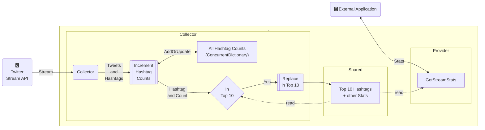
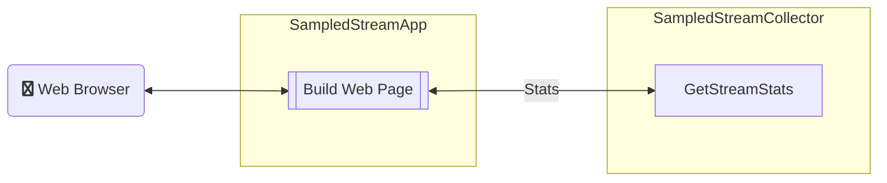

# TM Code Challenge Notes

[//]: # ( date: 06/02/22 )

## 1. Overview

This document contains (rudimentary) documentation and links for setting up and maintaining a .NET service to access a Twitter stream API and compute various statistics for the random tweets that it provides.

### 1.1. Table of Contents

- [1. Overview](#1-overview)
  - [1.1. Table of Contents](#11-table-of-contents)
- [2. Specification](#2-specification)
- [3. Folders and Files](#3-folders-and-files)
- [4. Usage and Testing](#4-usage-and-testing)
  - [4.1. Automated Unit Tests](#41-automated-unit-tests)
  - [4.2. Manual Tests](#42-manual-tests)
- [5. Next Steps / To Do List](#5-next-steps--to-do-list)
  - [5.1. To Do before submission](#51-to-do-before-submission)
  - [5.2. Future features and steps for consideration](#52-future-features-and-steps-for-consideration)
- [6. Design diagrams](#6-design-diagrams)
  - [6.1. SampledStream Web API](#61-sampledstream-web-api)
  - [6.2. SampledStream Web Application](#62-sampledstream-web-application)
- [7. Twitter APIs](#7-twitter-apis)
  - [7.1. Using Postman to access Twitter APIs](#71-using-postman-to-access-twitter-apis)
  - [7.2. Run / Debug the solution projects](#72-run--debug-the-solution-projects)
- [8. References](#8-references)

[//]: # ( spell-checker: ignore blazor choco dockerignore plantuml sampledstream )

## 2. Specification

- Your app should consume this sample stream and keep track of the following:
  - Total number of tweets received
  - Top 10 Hashtags
- Your app should also provide some way to report these values to a user (periodically log to terminal, return from RESTful web service, etc).
- If there are other interesting statistics you’d like to collect, that would be great. There is no need to store this data in a database; keeping everything in-memory is fine. That said, you should think about how you would persist data if that was a requirement.
- It’s very important that when the application receives a tweet it does not block statistics reporting while performing tweet processing. Twitter regularly sees 5700 tweets/second, so your app may likely receive 57 tweets/second, with higher burst rates. The app should process tweets as concurrently as possible to take advantage of available computing resources.

## 3. Folders and Files

| **Folder or File**     | **Description**                                                                  |
| ---------------------- | -------------------------------------------------------------------------------- |
| SampledStreamApp       | Folder containing Web app to display data collected from Twitter sampled stream  |
| SampledStreamCollector | Folder containing Web app to collect data from Twitter sampled stream            |
| `.dockerignore`        | List of files that Docker should ignore and not package                          |
| `.gitattributes`       | List of files and Git attributes that Git should use when performing its actions |
| `.gitignore`           | List of files that Git should ignore and not track                               |
| `README.md`            | This documentation file                                                          |
| `TMCodeChallenge.sln`  | Main Code Challenge Visual Studio Solution file                                  |

## 4. Usage and Testing

### 4.1. Automated Unit Tests

- Load solution `TMCodeChallenge.sln` into Visual Studio
- Select project SampledStreamApp
  - Note that all browser Unit Tests are currently hard coded to use Chrome (see To Do List)
  - Select `IIS Express` as Build Target on drop down (could also select `Docker` if you have Docker Desktop and WSL installed)
  - Optional:
    - Start project without Debugging (`Ctrl+F5`) to show default Web page on localhost
    - If this is not run then the Selenium tests of the results web page will be skipped
    - If this is run then the Selenium based tests of the results web page will be performed
  - Run all automated tests (`Ctrl+R, A`) or open the tests from Test Explorer (`Ctrl+E, T`) and run selected tests

### 4.2. Manual Tests

- Load solution `TMCodeChallenge.sln` into Visual Studio
- Select project SampledStreamCollector
  - Select `IIS Express` as Build Target on drop down (could also select `Docker` if you have Docker Desktop and WSL installed)
  - Select preferred Web Browser using Build Target drop down
  - Debug project (`F5`)
  - Use Swagger to Execute GET call to API
  - Examine response body
  - Execute API call repeatedly to see increasing numbers in stats
  - Test from command line `curl -X 'GET' 'https://localhost:44355/api/GetSampledStream' -H 'accept: text/plain'`
- Select project SampledStreamApp
  - Select `IIS Express` as Build Target (could also select `Docker` if you have Docker Desktop and WSL installed)
  - Select preferred Web Browser using Build Target drop down
  - Debug project (`F5`)
  - View stats
- Stop debugging (`Shift` `F5`)

## 5. Next Steps / To Do List

### 5.1. To Do before submission

- [x] Create SampleStreamedCollector project from ASP.NET Core Web API template in solution TMCodeChallenge
  - [x] Replace controller with dummy stream stats controller
  - [x] Add Test suite project and basic tests
  - [x] Add strategic exception handling
  - [x] Stats for API result to use shared class
    - [x] Return extra stats
  - [ ] Create background task to attach to Twitter stream
    - [ ] Add incoming tweets to concurrent queue with unit tests
  - [x] Create background service to pull incoming tweets from concurrent queue
    - [ ] Loop through tweets extracting hashtags, with unit tests
    - [ ] Add / update totals, with unit tests
    - [ ] Add / update top 10 tag list, with unit tests
- [x] Create SampleStreamedApp project from ASP.NET Core Web App template in solution TMCodeChallenge
  - [x] Replace home page with dummy stream stats
  - [x] Add Test suite project and basic tests
  - [x] Add Index Page Object to simplify testing
  - [ ] Add strategic exception handling and tests
  - [x] Stats for API result to use shared class
  - [ ] Call SampleStreamCollector API to retrieve stats
  - [ ] Add combo box for number of seconds for auto-refresh of stats
- [x] Create SampleStreamShared project from shared code library template in solution TMCodeChallenge
  - [x] Shared stats class for API result
    - [x] Total tweets
    - [x] Tweets per hour and per day
    - [x] Tweet queue count
    - [x] Top 10 tags and counts
- [x] Documentation
  - [x] Usage and testing
  - [ ] Update diagrams with latest design
- [ ] Submission email
  - [ ] Twitter API key
  - [ ] GitHub URL and authentication

### 5.2. Future features and steps for consideration

| Priority | Category     | Effort | Description                                                                                 |
| :------: | ------------ | :----: | ------------------------------------------------------------------------------------------- |
|    H     | Tests        |   M    | Test and document running of tests using `dotnet` command for CI/CD automation              |
|    M     | Security     |   M    | Add OAUTH to secure Swagger UI                                                              |
|    M     | Tooling      |   M    | Use gRPC for improving service performance and efficiency                                   |
|    M     | Tooling      |   M    | Use GraphQL for more advanced APIs                                                          |
|    M     | Tooling      |   M    | Build a class library for the entity data model for persistence                             |
|    M     | Tooling      |   S    | Create deployment automation script / Docker compose file for Docker containers             |
|    M     | Tests        |   S    | Add testing of Blazor rendered pages using bUnit                                            |
|    M     | Tests        |   M    | Enhance Web UI tests to also run in FireFox and Edge                                        |
|    M     | Tests        |   M    | Finish setting up unit tests to run in parallel                                             |
|    L     | Architecture |   M    | Replace worker BackgroundService implementation with a .NET Queue Service                   |
|    L     | UI           |   S    | Handle any multi-cultural and multi-lingual requirements such as date and number formatting |
|    L     | Tooling      |   S    | Minimize size of Docker containers by removing unneeded apps and tools                      |
|    L     | Tests        |   S    | Handle any remaining edge cases of running the date and time tests at exactly midnight          |

## 6. Design diagrams

### 6.1. SampledStream Web API



### 6.2. SampledStream Web Application



## 7. Twitter APIs

- [Apply for API access](https://developer.twitter.com/en/apply-for-access)

  ```sh
  # Sample results
  API Key: QAktM6W6DF6F7XXXXXX
  API Key Secret: AJX560A2Omgwyjr6Mml2esedujnZLHXXXXXX
  Bearer Token: AAAAAAAAAAAAAAAAAAAAAL9v6AAAAAAA99t03huuqRYg0mpYAAFRbPR3XXXXXXX
  ```

- Test from command prompt

  ```powershell
  # Set bearer token for testing access
  $env:BEARER_TOKEN = 'AAAAAAAAAAAAAAAAAAAAAL9v6AAAAAAA99t03huuqRYg0mpYAAFRbPR3XXXXXXX'
  # Test API access
  curl -X GET "https://api.twitter.com/2/tweets/sample/stream" -H "Authorization: Bearer ${env:BEARER_TOKEN}"
  ```

### 7.1. Using Postman to access Twitter APIs

- Install Postman using Chocolatey
  - `choco install postman -y`
- Import collection from [Twitter API v2 collection](https://github.com/twitterdev/postman-twitter-api)
- Set up consumer keys and tokens in Environment

  ```sh
  # Example key values
  consumer_key: `QAktM6W6DF6F7XXXXXX`
  consumer_secret: `AJX560A2Omgwyjr6Mml2esedujnZLHXXXXXX`
  access_token: `1995XXXXX-0NGqVhk3s96IX6SgT3H2bbjOPjcyQXXXXXXX`
  token_secret: `rHVuh7dgDuJCOGeoe4tndtjKwWiDjBZHLaZXXXXXX`
  bearer_token: `AAAAAAAAAAAAAAAAAAAAAL9v6AAAAAAA99t03huuqRYg0mpYAAFRbPR3XXXXXXX`
  ```

- Click `Send` and check for 200 OK response and then `Cancel`
- Response body will be empty because Twitter does not fill streams  for Postman
- Use Code | cURL to view the command, then copy and run it

### 7.2. Run / Debug the solution projects

## 8. References

- [Additional Visual Studio Templates](https://dotnetnew.azurewebsites.net/)
