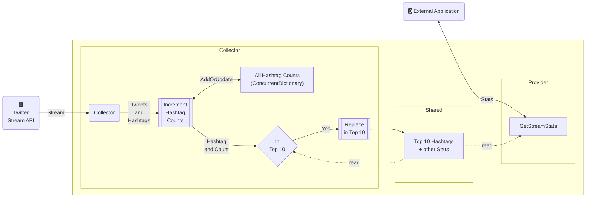
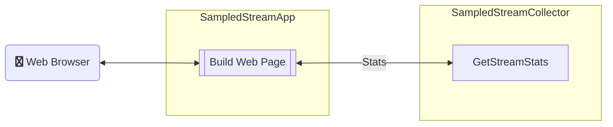

# TM Code Challenge Notes

[//]: # ( date: 05/26/22 )

## 1. Overview

This document contains (rudimentary) documentation and links for setting up and maintaining a .NET service to access a Twitter stream API and compute various statistics for the random tweets that it provides.

### 1.1. Table of Contents

- [1. Overview](#1-overview)
  - [1.1. Table of Contents](#11-table-of-contents)
- [2. Specification](#2-specification)
- [3. Folders and Files](#3-folders-and-files)
- [4. Design](#4-design)
  - [4.1. SampledStream Web API](#41-sampledstream-web-api)
  - [4.2. SampledStream Web Application](#42-sampledstream-web-application)
- [5. Usage](#5-usage)
- [6. Twitter APIs](#6-twitter-apis)
  - [6.1. Using Postman to access Twitter APIs](#61-using-postman-to-access-twitter-apis)
- [7. Development process](#7-development-process)
  - [7.1. Create the projects](#71-create-the-projects)
- [8. Next Steps / To Do List](#8-next-steps--to-do-list)
- [9. References](#9-references)

[//]: # ( spell-checker: ignore choco dockerignore sampledstream )

## 2. Specification

- Your app should consume this sample stream and keep track of the following:
  - Total number of tweets received
  - Top 10 Hashtags
- Your app should also provide some way to report these values to a user (periodically log to terminal, return from RESTful web service, etc).
- If there are other interesting statistics you’d like to collect, that would be great. There is no need to store this data in a database; keeping everything in-memory is fine. That said, you should think about how you would persist data if that was a requirement.
- It’s very important that when the application receives a tweet it does not block statistics reporting while performing tweet processing. Twitter regularly sees 5700 tweets/second, so your app may likely receive 57 tweets/second, with higher burst rates. The app should process tweets as concurrently as possible to take advantage of available computing resources.

## 3. Folders and Files

| **Folder or File**     | **Description**                                                                  |
| ---------------------- | -------------------------------------------------------------------------------- |
| SampledStreamCollector | Folder containing Web app to collect data from Twitter sampled stream            |
| `.dockerignore`        | List of files that Docker should ignore and not package                          |
| `.gitattributes`       | List of files and Git attributes that Git should use when performing its actions |
| `.gitignore`           | List of files that Git should ignore and not track                               |
| `README.md`            | This documentation file                                                          |
| `TMCodeChallenge.sln`  | Main Code Challenge Visual Studio Solution file                                  |

## 4. Design

### 4.1. SampledStream Web API



### 4.2. SampledStream Web Application



## 5. Usage

- Load solution in Visual Studio
- Select `IIS Express` as Build Target
- Debug project SampledStreamCollector (`F5`)
- Use Swagger to Execute GET call to API
- Examine response body
- Execute API call repeatedly to see an increasing total number of tweets
- Stop debugging

## 6. Twitter APIs

- [Apply for API access](https://developer.twitter.com/en/apply-for-access)

  ```sh
  # Sample results
  API Key: QAktM6W6DF6F7XXXXXX
  API Key Secret: AJX560A2Omgwyjr6Mml2esedujnZLHXXXXXX
  Bearer Token: AAAAAAAAAAAAAAAAAAAAAL9v6AAAAAAA99t03huuqRYg0mpYAAFRbPR3XXXXXXX
  ```

- Test from command prompt

  ```powershell
  # Set bearer token for testing access
  $env:BEARER_TOKEN = 'AAAAAAAAAAAAAAAAAAAAAL9v6AAAAAAA99t03huuqRYg0mpYAAFRbPR3XXXXXXX'
  # Test API access
  curl -X GET "https://api.twitter.com/2/tweets/sample/stream" -H "Authorization: Bearer ${env:BEARER_TOKEN}"
  ```

### 6.1. Using Postman to access Twitter APIs

- Install Postman using Chocolatey
  - `choco install postman -y`
- Import collection from [Twitter API v2 collection](https://github.com/twitterdev/postman-twitter-api)
- Set up consumer keys and tokens in Environment

  ```sh
  # Example key values
  consumer_key: `QAktM6W6DF6F7XXXXXX`
  consumer_secret: `AJX560A2Omgwyjr6Mml2esedujnZLHXXXXXX`
  access_token: `1995XXXXX-0NGqVhk3s96IX6SgT3H2bbjOPjcyQXXXXXXX`
  token_secret: `rHVuh7dgDuJCOGeoe4tndtjKwWiDjBZHLaZXXXXXX`
  bearer_token: `AAAAAAAAAAAAAAAAAAAAAL9v6AAAAAAA99t03huuqRYg0mpYAAFRbPR3XXXXXXX`
  ```

- Click `Send` and check for 200 OK response and then `Cancel`
- Response body will be empty because Twitter does not fill streams  for Postman
- Use Code | cURL to view the command, then copy and run it

## 7. Development process

### 7.1. Create the projects

- Create SampleStreamedCollector project from ASP.NET Core Web API template in solution TMCodeChallenge
- x

## 8. Next Steps / To Do List

| Priority | Category | Description                                                     |
| :------: | -------- | --------------------------------------------------------------- |
|    M     | Security | Add OAUTH to secure Swagger UI                                  |
|    M     | Tooling  | Use gRPC for improving service performance and efficiency       |
|    M     | Tooling  | Use GraphQL for more advanced APIs                              |
|    M     | Tooling  | Build a class library for the entity data model for persistence |
|          |          |                                                                 |
|          |          |                                                                 |
|          |          |                                                                 |
|          |          |                                                                 |
|          |          |                                                                 |

## 9. References

- [Additional Visual Studio Templates](https://dotnetnew.azurewebsites.net/)
